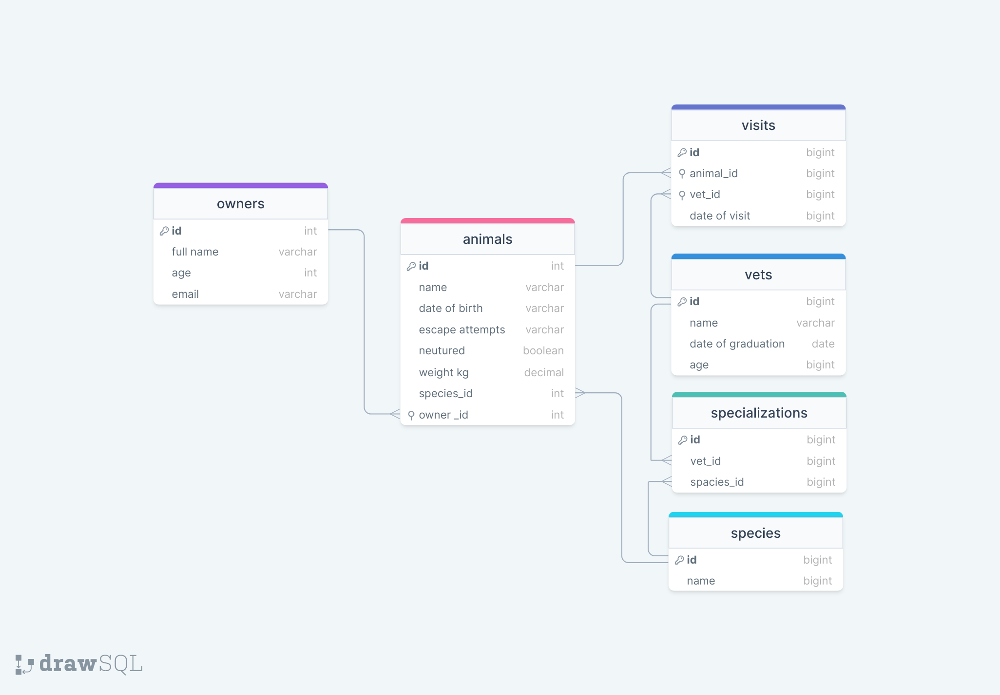

  <h1><b>Vet clinic database</b></h1>

<!-- TABLE OF CONTENTS -->

# 📗 Table of Contents

- [📖 About the Project](#about-project)
  - [🛠 Built With](#built-with)
    - [Tech Stack](#tech-stack)
    - [Key Features](#key-features)
- [🚀 Live Demo](#live-demo)
- [💻 Getting Started](#getting-started)
- [👥 Authors](#authors)
- [🔭 Future Features](#future-features)
- [🤝 Contributing](#contributing)
- [⭐️ Show your support](#support)
- [🙏 Acknowledgements](#acknowledgements)
- [📝 License](#license)

<!-- PROJECT DESCRIPTION -->

# 📖 Vet clinic database 

**Vet clinic database** is a database that store the information of animals in clinic.

##  Database Schema Diagram

## 🛠 Built With 

### Tech Stack 

  
Client

  <ul>
    <li>HTML</li>
    <li>CSS/SASS</li>
    <li>JavaScript</li>
  </ul>

  
Server

  <ul>
    <li>Render</li>
  </ul>

Database

  <ul>
    <li>PostgreSQL</li>
  </ul>

<!-- Features -->

### Key Features 

- **[storing the animals information]**
- **[User-friendly interface]**
- **[Dynamic content]**

<a href="#readme-top">Back to top</a>

<!-- LIVE DEMO -->

## 🚀 Live Demo 

under work

<a href="#readme-top">Back to top</a>

<!-- GETTING STARTED -->
## Getting Started

This repository includes files with plain SQL that can be used to recreate a database:

- Use [schema.sql](./schema.sql) to create all tables.
- Use [data.sql](./data.sql) to populate tables with sample data.
- Check [queries.sql](./queries.sql) for examples of queries that can be run on a newly created database. **Important note: this file might include queries that make changes in the database (e.g., remove records). Use them responsibly!**

<!-- AUTHORS -->

## 👥 Authors 

👤 **Ghulam Reza Rajabi**

- GitHub: [@ghreza-crypto](github.com/ghreza-crypto)
- LinkedIn: [LinkedIn](linkedin.com/in/ghulam-reza-rajabi)

<a href="#readme-top">Back to top</a>

## 🔭 Future Features 

- [ ] **[Improve UI design]**
- [ ] **[Improve the desktop version]**

<a href="#readme-top">Back to top</a>

<!-- CONTRIBUTING -->

## 🤝 Contributing 

Contributions, issues, and feature requests are welcome!

Feel free to check the [issues page](../../issues/).

<a href="#readme-top">Back to top</a>

<!-- SUPPORT -->

## ⭐️ Show your support 

If you like this project you can give it a star!

<a href="#readme-top">Back to top</a>

<!-- ACKNOWLEDGEMENTS -->

## 🙏 Acknowledgments 

I would like to [Nelson Sakwa](https://www.behance.net/sakwadesignstudio) because this project is based on his original design idea.

<a href="#readme-top">Back to top</a>

<!-- FAQ (optional) -->

## 📝 License 

This project is [MIT](./MIT.md) licensed.

<a href="#readme-top">Back to top</a>
